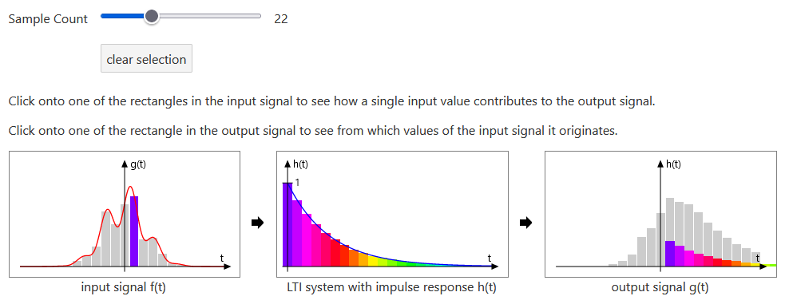

[Live Demo](https://static.laszlokorte.de/lti/) | [Short demo video](https://www.youtube.com/watch?v=gh3KnebmbHo)

# LTI System impulse response

An linear and time-invariant system (LTI-system) transforms an input signal to an output signal. Linearity means that if the input is a sum of multiple individual signals, the output is the same as the sum of each individual transformed signal. Time-invariance means that if the input signal is shifted in time the output is the same as for the non-shifted input but shifted as well.

These two properties allow to understand the systems behavior by understanding just it's response to a single impulse (very short rectangle). All other signals can the be thought of as a sum of shifted impulses.

Above you can see how the input signal (red curve) can be decomposed into many rectangles. The blue curve shows the systems response to a single impulse. The output signal shows the systems output given the full input signal.

By clicking onto the sampled rectangles of the input signal you can see how a single rectangle of the input contributes to the output by being replicated and scaled according to the impulse response. Clicking a rectangle in the output signal shows which rectangles from the input contributed to the selected output rectangle.
